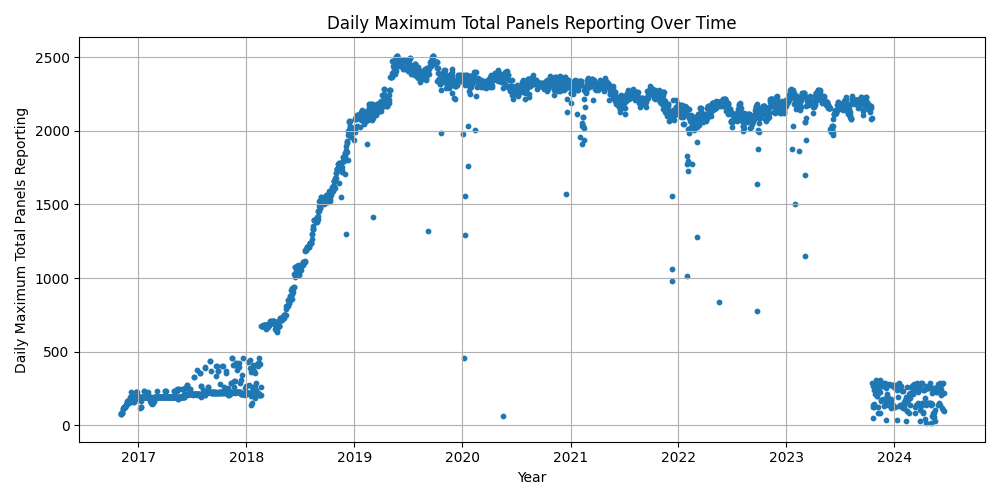

# [DEPRECATED] Solar Energy Production - Halifax Regional Municipality

**This project is now deprecated.**

The primary source of training data for this ML project has been compromised.

Starting in late 2023, a substantial proportion of microinverters began failing to report energy readings for solar panel installations.

Recent microinverter readings would have served as the baseline for model prediction. Without this data, predictions would have such large confidence intervals that the model would not be useful for achieving business objectives.

Public-sector data fragility is a legitimate concern for all government entities. With limited resources and a wide array of policy objectives, decisions not to pursue a fix are matter of stakeholder prioritization.

(Last commit: November 20, 2025)
